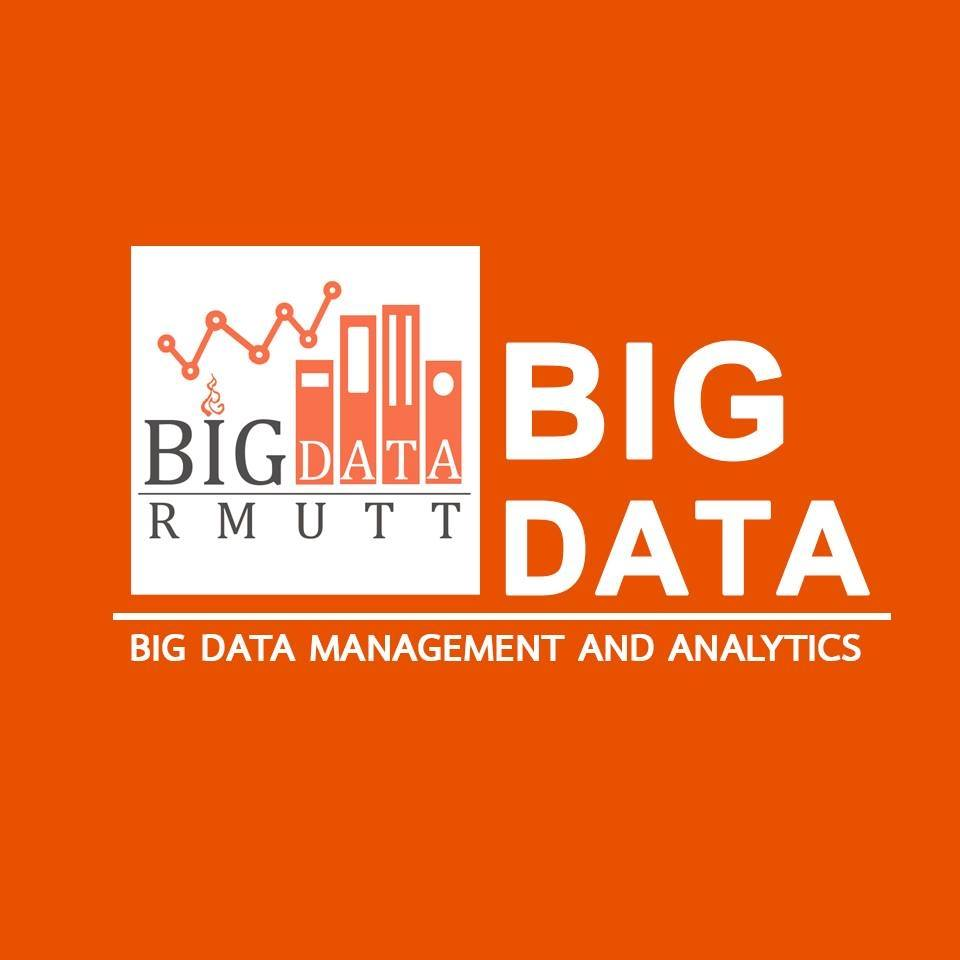

<h1 align="center"><b>Anomaly Detection</b> - Mini Machine Learning and AI Project</h1>

---

 
                ให้นักศึกษาใช้กระบวนการการเรียนรู้ของเครื่องในการทำนายค่าระดับน้ำในช่วงเวลาต่าง ๆ (สำหรับทุก ๆ ไฟล์ข้อมูล) ด้วย orange canvas  

## 📝 Table of Contents

- [About](#about)
- [Getting Started](#getting_started)
- [Deployment](#deployment)
- [Usage](#usage)
- [Built Using](#built_using)
- [Contributing](../CONTRIBUTING.md)
- [Authors](#authors)
- [Acknowledgments](#acknowledgement)

## 🧐 About | เกี่ยวกับโปรเจค 

 

Mini Machine Learning and AI Project 
<b>My team :	</b> 

- [Mr.THANAPHOL NANTAKASET @SatangThevalue](https://github.com/SatangThevalue)
- [Mr. CHALERMWUT SUDPRASERT @13EC4USE](https://github.com/13EC4USE) 

<b>FACULTY :</b>	[Science and Technology](https://www.sci.rmutt.ac.th/) 
<b>PROGRAM :</b>	[Big Data Management and Analytics](https://www.bigdata.rmutt.ac.th/)  

 <h1> Overall | ภาพรวมทั้งโปรเจค </h1> 
 

 

 

### 🏁 Getting Started | เริ่มต้นใช้งาน 

This project was built in Orange data mining. 

### Prerequisites | ข้อกำหนดเบื้องต้น

- Orange data mining
- Anaconda
- Python

## 🚀 Deployment | การปรับใช้ 

Use Orange data mining.

## ⛏️ Built Using | สร้างโดยใช้ 
- [Orange data mining](https://orangedatamining.com/)

## ✍️ Contributions and thanks | ขอบคุณเพื่อนร่วมทีมของเรา 

- [Mr.THANAPHOL NANTAKASET @SatangThevalue](https://github.com/SatangThevalue)
- [Mr. CHALERMWUT SUDPRASERT @13EC4USE](https://github.com/13EC4USE) 

## 🎉 Acknowledgements | กิตติกรรมประกาศ 

- [Getting Started Guide](https://orangedatamining.com/docs/)